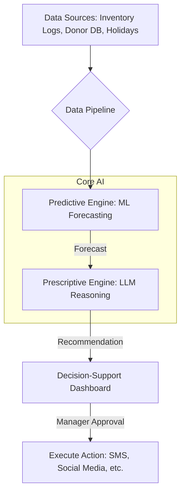

# Aura: The AI-Powered Blood Inventory Management System 🩸

**Aura is an open-source project designed to revolutionize blood bank management by moving from a reactive to a proactive, AI-driven decision-support system. It aims to reduce shortages, minimize wastage, and ultimately save lives.**

---

## The Core Problem

Blood bank managers often operate in a reactive state. They know when inventory is currently low, but they lack the tools to accurately predict future shortages and take optimal, timely action. Current Blood Bank Management Systems (BBMS) are excellent systems of record, but not intelligent systems for proactive optimization.

---

## The Aura Solution

Aura is not just another inventory tracker. It's a strategic assistant for blood bank managers. It integrates two key AI components to provide a complete, end-to-end solution.

### 1. The Predictive Engine (The Forecast 🔮)
Using time-series analysis and machine learning models (like SARIMA, Prophet, and LSTMs), Aura analyzes historical data, holidays, and other contextual factors to generate a reliable 7-10 day forecast of blood demand for each blood type.

### 2. The Prescriptive Engine (The Strategist 🧠)
This is Aura's core innovation. The forecast is fed into a **Large Language Model (LLM)** that acts as a reasoning engine. It assesses the predicted supply vs. demand and, instead of just raising an alert, it recommends specific, actionable, and optimized solutions, such as:
* *"Launch a targeted SMS campaign to 150 previous O- donors."*
* *"Plan a donation drive at the local university campus this Thursday for maximum impact."*
* *"Draft a social media post highlighting the need for B+ blood."*

---

## System Architecture

The workflow is designed to be a seamless pipeline from raw data to actionable insight.

## Technology Stack
Aura is built with a modern, open-source technology stack.

#### Backend: Python

#### API: FastAPI, Flask

#### Data Science: Pandas, NumPy, Scikit-learn, Prophet, TensorFlow/PyTorch

#### LLM Integration: LangChain, Hugging Face Transformers

#### Database: PostgreSQL, SQLite (for development)

#### Frontend (Prototype): Streamlit

#### Frontend (Production): React / Vue.js

## Getting Started
Follow these instructions to get a local copy up and running for development and testing purposes.

###Prerequisites
#### 1) Python 3.9+

#### 2) Git

#### 3) pip or conda for package management

##Installation
### 1) the repository:
`git clone [https://github.com/Vanshika-mahajan/aura-blood-inventory-ai.git](https://github.com/Vanshika-mahajan/aura-blood-inventory-ai.git)
cd aura-blood-inventory-ai`
### 2)Create and activate a virtual environment:
`python -m venv venv
source venv/bin/activate ` # On Windows, use 'venv\Scripts\activate'
### 3)Install the required dependencies:
`pip install -r requirements.txt`
### 4)Set up environment variables:
Create a .env file in the root directory by copying the example file.
`cp .env.example .env`
Fill in the necessary API keys or configuration details in your new .env file.
###5)Run the application:
Example for running a Streamlit dashboard
`streamlit run app/dashboard.py`
## Project Roadmap
This project is divided into four key phases. We are currently in Phase 1.

#### [x] Phase 1: Data Foundation & Synthesis (In Progress)

[x] Identify core data requirements

[ ] Develop scripts to generate a realistic, synthetic dataset

[ ] Set up database schema

#### [ ] Phase 2: Predictive Engine Development

[ ] Implement baseline forecasting models (SARIMA, Prophet)

[ ] Experiment with ML models (XGBoost, LSTM)

[ ] Validate model accuracy and performance

#### [ ] Phase 3: Prescriptive Engine Integration

[ ] Define actionable functions (e.g., send_sms, plan_drive)

[ ] Integrate an open-source LLM (e.g., Llama 3, Mistral)

[ ] Implement reasoning logic with function calling

#### [ ] Phase 4: Decision-Support Dashboard

[ ] Develop a backend API with FastAPI

[ ] Build an intuitive UI with Streamlit (for MVP)

[ ] Implement a feedback loop for recommendations

## How to Contribute
Contributions are what make the open-source community such an amazing place to learn, inspire, and create. Any contributions you make are greatly appreciated.

Please see the CONTRIBUTING.md file for details on our code of conduct and the process for submitting pull requests to us.

## License
Distributed under the MIT License. See LICENSE for more information.
### Acknowledgments
UCI Machine Learning Repository for the foundational dataset on donor behavior.

The open-source community for providing the tools that make this project possible.
